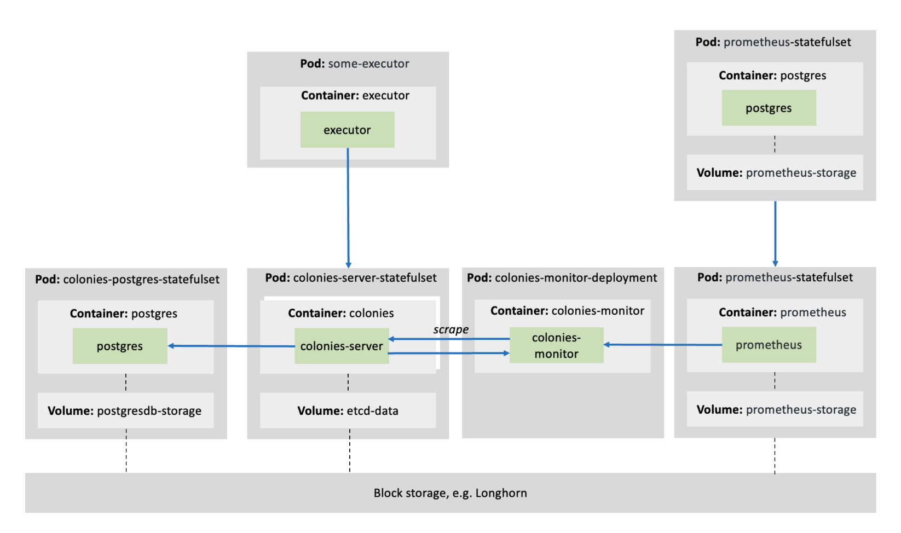

# Introduction
The Helm chart will deploy several pods, which is illustrated in the figure below.


| Service                 | Purpose                                                                     |
| ---                     | -----------                                                                 |
| PostgreSQL              | Used by Colonies server to store states.                                    |
| Colonies server(s)      | Provides the Colonies API.                                                  |
| Colonies monitor server | Provider Prometheus metrics. Scrapes the Colonies API.                      |
| Prometheus              | Connected to the Colonies Monitor server to build up a monitoring database. |
| Grafana                 | Visualization service.                                                      |
| Executors               | Various Colonies executors.                                                 |

# Installation
Edit `values.yaml` and type:

```console
./install.sh
```

# Configuration options
| Setting                         | Description                                                                                                      | Example value                        |
| ---                             | -----------                                                                                                      | ---                                  |
| StorageClassName                | Storage class to use for K8s persistant volumes.                                                                 | local-path, longhorn, ebs-sc         |
| Timezone                        | Timezone.                                                                                                        | "Europe/Stockholm"                   |
| Ingress                         | Enable/disable K8s ingress controller. If enabled, ColoniesServerHostName must be specified.                     | true/false                           |
| IngressController               | Ingress controller to use.                                                                                       | nginx or traefik                     |
| ColoniesServerHostname          | Host name to use ingress controller. A TLS cert will be automatically obtained by Cert manager.                  | "colones.colonyos.io"                |
| ExposeNodePort                  | Enable/disable nodeports.                                                                                        | true/false                           |
| NodePort                        | Nodeport to use, must be in range 30000-3276.                                                                    | 30000                                |
| ImagePullSecret                 | Image pull secret.                                                                                               | PASSWORD                             |
| ColoniesDBHost                  | Hostname to PostgreSQL server.                                                                                   | "colonies-postgres-service.colonyos" |
| ColoniesDBPort                  | PostgreSQL server port.                                                                                          | 5432                                 |
| ColoniesServerReplica           | Number of Colonies servers to start. See High-availability table below.                                          | 3                                    |
| ColoniesServerImage             | Colonies server Docker image                                                                                     | "colonyos/colonies:latest"           |
| ColoniesServerID                | ECDSA ID (public key). Generate a new ID using "colonies keychain generate" command.                             | "03923d531c54e27f81fac54f....."      |
| ColoniesServerPrvKey            | ECDSA ID (public key). Generate a new ID using "colonies keychain generate" command.                             | "fcc79953661592dc34d30004....."      |
| ColoniesResourceLimit           | Enable CPU and memory limits.                                                                                    | true/false                           |
| ColoniesServerCPU               | CPU request.                                                                                                     | "4000m"                              |
| ColoniesServerMemory            | Memory request and limit.                                                                                        | "16000Mi"                            |
| ColoniesServerProfiler          | Enable/disable Golang profiler.                                                                                  | true/false                           |
| ColoniesServerProfilerPort      | Profiler port                                                                                                    | 6060                                 |
| ColoniesCronCheckerPeriod       | How often to run internal cron checker in milliseconds.                                                          | "1000"                               |
| ColoniesGeneratorCheckerPeriod  | How often to run internal generator checker in milliseconds.                                                     | "500"                                |
| ColoniesVerbose                 | Enable/disable debug printouts.                                                                                  | true/false                           |
| ColoniesExclusiveAssign         | If true, it is guaranteed that exactly one process is assigned to one executor. This could decrease performance. | true/false                           |
| ColoniesAllowExecutorReregister | If true, it is possible to register an executor with the same name before first deregister it.                   | true/false                           |
| ColoniesRetention               | Enable/disable retention.                                                                                        | true/false                           |
| ColoniesRetentionPolicy         | How many seconds to keep successful processes. Failed, waiting or running processes are never purged.            | 604800                               |
| DBUser                          | PostgreSQL user name to use when creating database.                                                              | PASSWORD                             |
| DBPassword                      | PostgreSQL password use when creating database.                                                                  | postgres                             |
| DBImage                         | PostgreSQL image to use.                                                                                         | postgres:12.15-bullseye              |
| DBResourceLimit                 | Enable CPU and memory limits.                                                                                    | true/false                           |
| DBCPU                           | CPU request.                                                                                                     | "4000m"                              |
| DBMemory                        | Memory request and limit.                                                                                        | "16000Mi"                            |
| DBStorage                       | PostgreSQL volume size (/var/lib/postgresql)                                                                     | 10Gi                                 |
| ColoniesMonitorInterval         | How often (in seconds) to run pull Colonies API for statistics.                                                  | 10                                   |
| ColoniesServerInternalHostname  | Internal hostname inside pod to Colonies server                                                                  | "colonies-service.colonyos"          |
| ColoniesMonitorResourceLimit    | Enable CPU and memory limits.                                                                                    | true/false                           |
| ColoniesMonitorCPU              | CPU request.                                                                                                     | "4000m"                              |
| ColoniesMonitorMemory           | Memory request and limit.                                                                                        | "16000Mi"                            |
| PrometheusImage                 | Prometheus Docker image.                                                                                         | prom/prometheus                      |
| PrometheusStorage               | Prometheus volume size                                                                                           | 10Gi                                 |
| PrometheuResourceLimit          | Enable CPU and memory limits.                                                                                    | true/false                           |
| PrometheuCPU                    | CPU request.                                                                                                     | "4000m"                              |
| PrometheuMemory                 | Memory request and limit.                                                                                        | "16000Mi"                            |
| ScrapeIntervall                 | How often to scrape the Colonies monitor server.                                                                 | 10s                                  |
| ColoniesMonitoringServer        | Host to the Colonies monitor server.                                                                             | colonies-monitor-service.colonyos    |

# Monitoring
Use this data source in Grafana.
http://prometheus-service.NAMESPACE:9090

# High-availability
Colonies uses the RAFT protocol internally. See the table below for replication factors and how to set the ColoniesServerReplicas setting. 

| Colonies Server Replicas | Majority | Failure Tolerance |
|:------------------------:|:--------:|:-----------------:|
|            1             |    1     |         0         |
|            2             |    2     |         0         |
|            3             |    2     |         1         |
|            4             |    3     |         1         |
|            5             |    3     |         2         |
|            6             |    4     |         2         |
|            7             |    4     |         3         |
|            8             |    5     |         3         |
|            9             |    5     |         4         |
